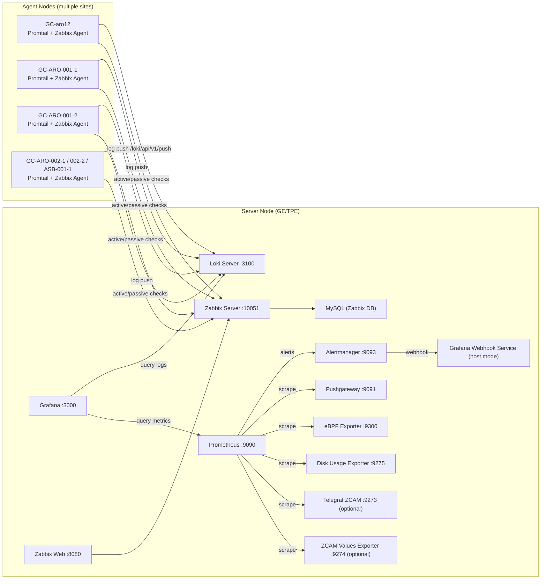
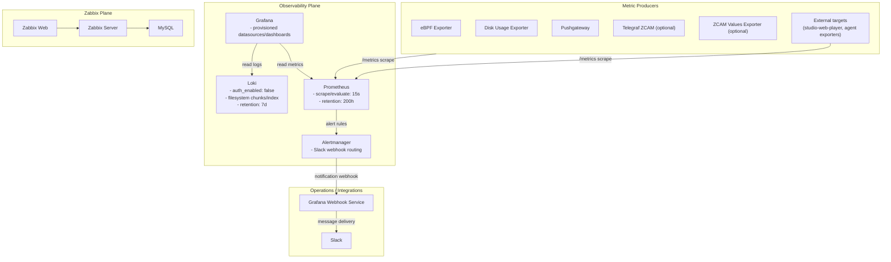
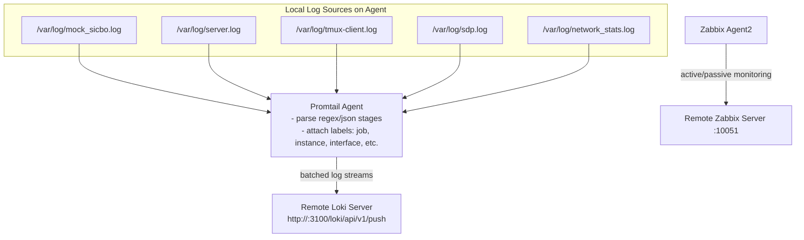
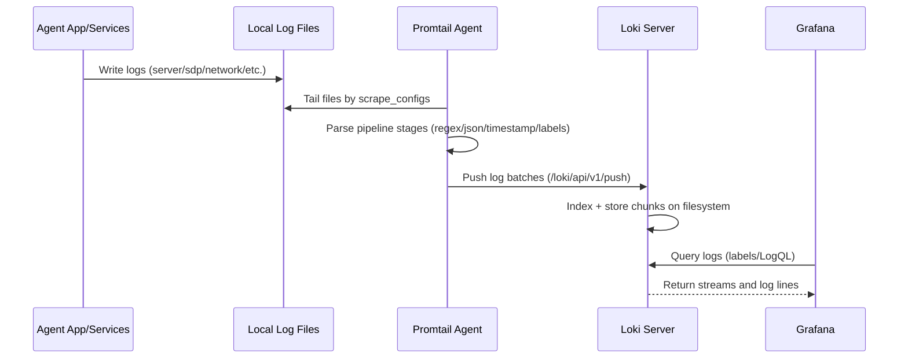
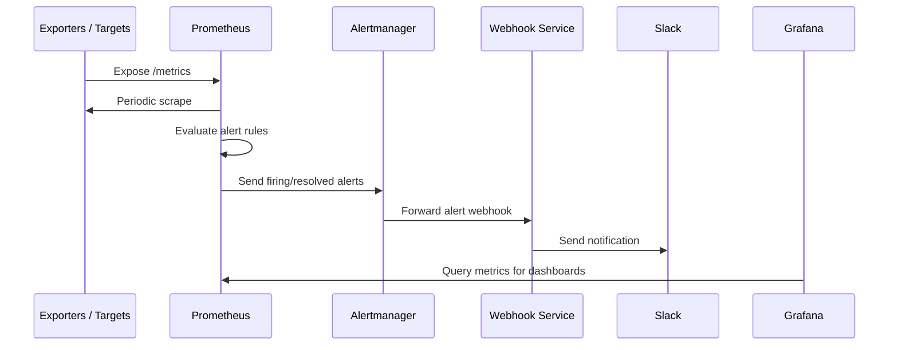

# Telemetry Architecture (Agent + Server)

This document describes the service architecture, topology, and data flow
for the `telemetry` project using Mermaid diagrams.

## 1) High-Level Topology

## 2) Server-Side Service Architecture

## 3) Agent-Side Service Architecture

## 4) Log Data Flow (End-to-End)

## 5) Metrics and Alert Data Flow

## 6) Network and Deployment Topology Notes

- Server mode is designed for GE/TPE environments (for example, GE:
  `100.64.0.113`, TPE: `100.64.0.160`).
- Agent nodes run lightweight services only (Promtail + Zabbix Agent).
- Logs are centralized in Loki; metrics are centralized in Prometheus.
- Grafana is the unified visualization layer for both logs and metrics.
- Zabbix remains a parallel monitoring plane with its own database and web UI.
- Optional stacks (`telegraf-zcam`, `zcam-values-exporter`) join the same
  `telemetry_monitoring` network and are scraped by Prometheus.
